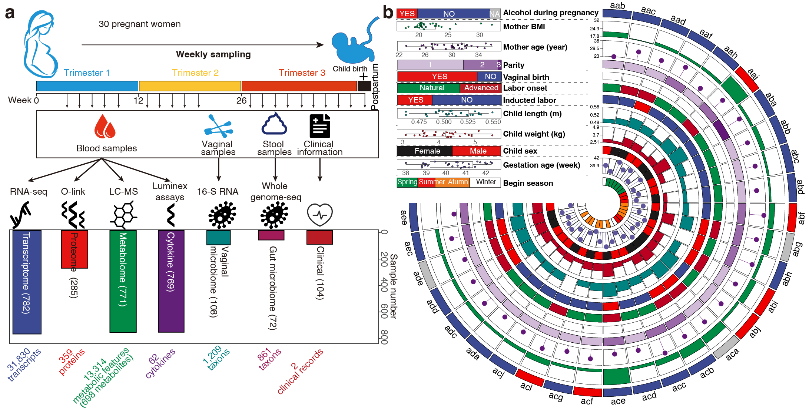
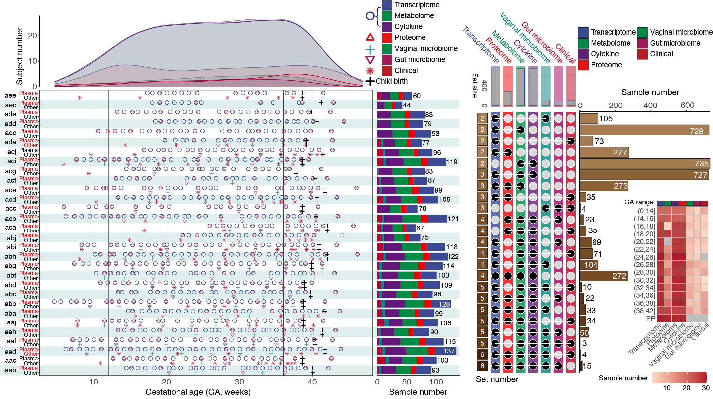

## Project Description

This project aims to visualize the changes in molecules during human pregnancy. Using data from several participants, we track molecular changes throughout different stages of pregnancy.

The interactive visualizations provide insights into how these molecules behave and change over time, shedding light on the intricate processes of human pregnancy.

The interactive visualizations provide insights into how these molecules behave and change over time, shedding light on the intricate processes of human pregnancy.

